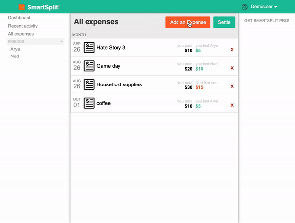
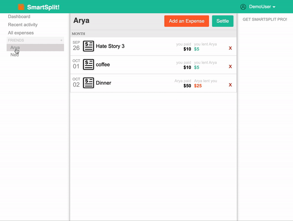
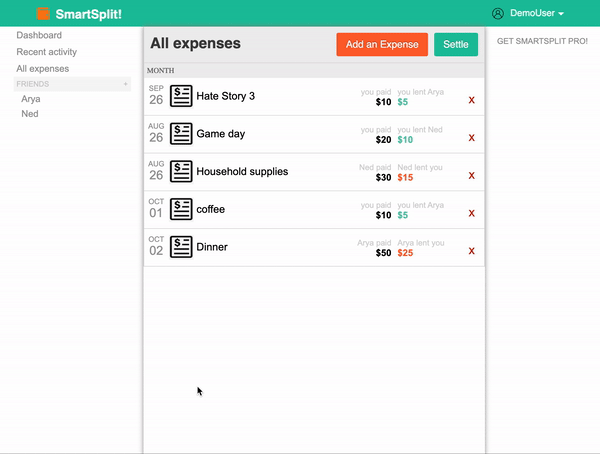

# README

SmartSplit is a full stack single page application clone of splitwise. Users can add an expense, delete an expense, add notes to the expense, share the expense with friends and smartsplit will calculate what share does each one owe.

[Live Demo](https://smartsplit2.herokuapp.com/#/)

## Technologies Used

### Backend
* PostgreSQL
* Ruby on Rails

### Frontend
* React
* Redux

### Packages/Api's
* [React-calender](https://www.npmjs.com/package/react-calendar)

## Features
* Full user authentication (signUp, Login and logout) with security
* Add expense based on the type of category, choose who paid the bill, select a friend to share the expense with from your list of friends
* Upload receipts

Adding expense

List of expenses with a friend

Details about an expense

### Future Implementations
* Displaying recent activities
* Create a group to share the expense
